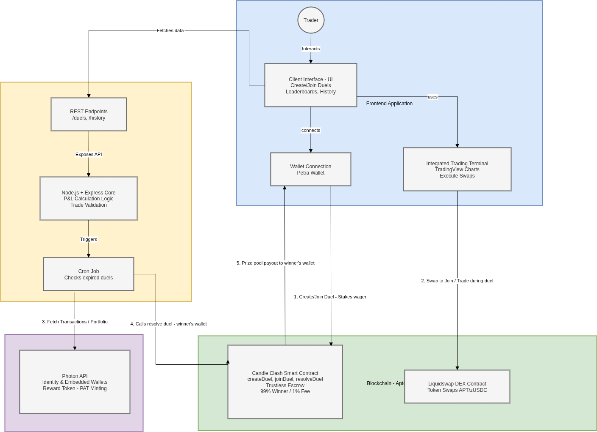

# 🕯️ Candle Clash

<div align="center">

**The First Gamified 1v1 Trading Battle Arena on Aptos**

*Where Trading Meets Competition. Where Skill Beats Capital.*

[](https://aptoslabs.com/)
[](https://www.typescriptlang.org/)
[](https://reactjs.org/)
[](https://move-language.github.io/move/)

</div>

---

## 🎯 The Vision

**Candle Clash** transforms DeFi trading into a competitive, skill-based social game. Two traders engage in head-to-head "duels," wagering cryptocurrency on who can achieve higher trading performance over a set period. Unlike traditional trading platforms where whales dominate, Candle Clash levels the playing field by measuring **Profit & Loss percentage** rather than portfolio size.

### Why Candle Clash?

- 🎮 **Gamified Trading**: Turn trading into an exciting 1v1 competition
- ⚖️ **Fair Competition**: P&L percentage ensures equal opportunity regardless of capital
- 🔒 **Trustless Escrow**: Smart contracts handle all wagers and payouts automatically
- 🚀 **Zero Friction**: Multiple authentication options for easy access
- 💎 **Real Swaps**: Integrated Liquidswap DEX for actual on-chain trading
- 🏆 **Leaderboard Rewards**: Daily top traders earn PAT tokens via Photon

---

## ✨ Key Features

- **Smart Contract** (`move/sources/duel_arena.move`)
  - ✅ Create, join, and resolve duels
  - ✅ Trustless escrow system
  - ✅ Automatic refund mechanism for expired duels
  - ✅ Event emission for all duel lifecycle stages
  - ✅ Deployed on Aptos Mainnet

- **Frontend Application**
  - ✅ Cyberpunk-themed UI with animations
  - ✅ Real-time candlestick charts (lightweight-charts)
  - ✅ Live P&L tracking during duels
  - ✅ Lobby system with grid view of all duels
  - ✅ Individual duel detail pages
  - ✅ Responsive design for all screen sizes

- **Trading Integration**
  - ✅ **Liquidswap DEX Integration**: Real APT ↔ zUSDC swaps on-chain
  - ✅ Swap history tracking within duels
  - ✅ Balance management and validation
  - ✅ Slippage protection and price estimation

- **Authentication & Wallets**
  - ✅ Multiple wallet connection options
  - ✅ Petra Wallet integration
  - ✅ Session persistence across page refreshes
  - ✅ Seamless wallet switching

- **Backend Services**
  - ✅ Express.js referee service for P&L resolution
  - ✅ Automated duel winner determination
  - ✅ On-chain contract interaction for payouts
  - ✅ Leaderboard tracking and scoring

- **Photon Integration**
  - ✅ User onboarding to Photon platform
  - ✅ Campaign event tracking
  - ✅ PAT token rewards for leaderboard winners
  - ✅ Embedded wallet creation

- **Leaderboard System**
  - ✅ Daily leaderboard with top 10 traders
  - ✅ Activity tracking (duels created, joined, won, swaps executed)
  - ✅ Score calculation and ranking
  - ✅ Claim functionality for rewards

## 💰 Value Proposition

### Market Size & User Attraction

**Candle Clash addresses a massive underserved market in DeFi:**

1. **Gaming + Trading Crossover Market**
   - **Target**: 50M+ active crypto traders globally + 3B+ gamers worldwide
   - **Attraction**: Combines competitive gaming psychology with real financial rewards
   - **Addressable Market**: Even 1% penetration = 500K+ potential users
   - **Why they'll come**: First platform where trading skill matters more than capital

2. **Retail Trader Empowerment**
   - **Target**: 40M+ retail crypto traders who can't compete with whales
   - **Attraction**: $10 wager can compete with $10,000 wager on equal footing
   - **Addressable Market**: Majority of retail traders (30M+) feel excluded from competitive trading
   - **Why they'll come**: Finally, a level playing field where skill wins

3. **Social Trading Community**
   - **Target**: 100M+ users on trading social platforms (eToro, TradingView, etc.)
   - **Attraction**: Real-time 1v1 battles with instant results and leaderboards
   - **Addressable Market**: Social trading is a $2B+ market growing 15% annually
   - **Why they'll come**: Gamified competition with real stakes and rewards

4. **Aptos Ecosystem Growth**
   - **Target**: Entire Aptos user base (growing rapidly)
   - **Attraction**: First-of-its-kind platform on Aptos, no direct competitors
   - **Addressable Market**: Early mover advantage in Aptos DeFi gaming
   - **Why they'll come**: Novel use case, integrated rewards, low barrier to entry

5. **Daily Active User Potential**
   - **Conservative Estimate**: 10,000-50,000 DAU within 6 months
   - **Moderate Estimate**: 50,000-200,000 DAU with marketing
   - **Optimistic Estimate**: 200,000+ DAU with viral growth
   - **Retention Driver**: Daily leaderboard rewards create habitual usage

### Why Users Will Choose Candle Clash

- **Fair Competition**: P&L percentage means capital doesn't determine winners
- **Real Rewards**: Actual cryptocurrency winnings, not just points
- **Social Proof**: Leaderboard creates status and recognition
- **Low Barrier**: Small wagers ($1+) enable participation for all
- **Trustless**: Smart contracts eliminate counterparty risk
- **Integrated**: No need to leave platform - trading happens in-app
- **Rewarding**: Daily PAT token rewards for top performers

### Market Opportunity

- **Total Addressable Market (TAM)**: 100M+ crypto traders + 3B+ gamers = $50B+ market
- **Serviceable Addressable Market (SAM)**: 10M+ active DeFi users = $5B+ market
- **Serviceable Obtainable Market (SOM)**: 1M users in first year = $500M+ market
- **Monetization**: 1% protocol fee on all duel winnings scales with user base

### 🌟 Photon Integration (Bonus Track)

**We have fully integrated Photon for Identity, Engagement, and Rewards:**

1.  **Unified Identity & Embedded Wallet**
    -   **Implementation**: Auto-onboarding to Photon upon Google Sign-In.
    -   **Impact**: Creates a Photon identity and embedded wallet for every user seamlessly.

2.  **Rewarded Actions (Earn PAT)**
    -   **Event**: `leaderboard_reward` / `game_win`
    -   **Mechanism**: Top 10 daily traders can claim PAT tokens directly to their Photon wallet.
    -   **Verification**: Fully working flow with transaction confirmation.

3.  **Analytics & Attribution**
    -   **Events Tracked**: `duel_created`, `duel_joined`, `duel_won`, `duel_lost`, `duel_watched`.
    -   **Usage**: Tracks user engagement lifecycle to optimize retention.

### 🚧 **Future Enhancements** (Post-Hackathon)

- Oracle integration for automated resolution
- Multi-token support beyond APT/zUSDC
- Tournament mode with brackets
- Social features (chat, follow, share)

---

## 🏆 Originality

### What Makes Candle Clash Unique?

1. **First-of-its-Kind on Aptos**
   - No existing 1v1 trading battle platform on Aptos
   - Novel combination of gamification + DeFi + social competition

2. **P&L Percentage-Based Victory**
   - Unlike traditional leaderboards based on absolute profit
   - Ensures fair competition regardless of capital size
   - New traders can compete with whales on equal footing

3. **Integrated Trading Experience**
   - Trading happens **within** the duel interface
   - Real swaps via Liquidswap, tracked in real-time
   - P&L calculated only from duel-period trades
   - No need to leave the platform

4. **Hybrid Authentication System**
   - Multiple wallet options for flexible onboarding
   - Traditional wallet (Petra) for power users
   - Seamless switching between both

5. **Community-Driven Cleanup**
   - Public `refund_expired()` function
   - Anyone can clean up expired duels
   - Incentivizes platform maintenance

---

## 🎨 Design & User Experience

### Visual Design

- Dark theme with neon accent colors
- Color palette: Neon Green (`#00ff41`) for positive states, Magenta (`#ff0080`) for actions
- Monospace typography for addresses and prices
- Emoji-based iconography for visual recognition

### User Experience Features

- Real-time candlestick charts with live price updates
- Live P&L tracking during active duels
- Timer countdown with visual indicators
- Grid-based lobby layout for duel browsing
- Individual duel detail pages with full trading interface
- Loading states and error handling throughout
- Responsive design for mobile and desktop

---

## 💡 Innovation

### Technical Innovations

1. **Smart Contract Architecture**
   ```move
   // Novel escrow system with automatic refunds
   struct Duel has key, store {
       pot: coin::Coin<AptosCoin>,  // Direct coin storage
       is_active: bool,
       start_time: u64,
   }
   ```
   - Direct coin storage in struct (gas efficient)
   - Time-based expiration logic
   - Public cleanup functions

2. **Real-Time P&L Calculation**
   - Tracks swaps executed during duel period only
   - Calculates percentage-based P&L
   - Updates in real-time as trades execute
   - Snapshot-based comparison (start vs current)

3. **Flexible Wallet System**
   - Multiple wallet connection options
   - Traditional wallets for advanced users
   - Unified interface for all wallet types
   - Session management across connections

4. **Event-Driven Architecture**
   - Smart contract events for all state changes
   - Frontend polling with exponential backoff
   - Backend event indexing for leaderboard
   - Decoupled frontend/backend communication

5. **Integrated DEX Swapping**
   - Direct Liquidswap router integration
   - Real-time price estimation
   - Slippage protection
   - Balance validation before swaps

6. **Leaderboard Scoring Algorithm**
   ```typescript
   Score = (Duels Created × 10) 
        + (Duels Joined × 5) 
        + (Duels Won × 20) 
        + (Swaps × 1) 
        + (Wagered APT)
   ```
   - Rewards participation and skill
   - Daily reset mechanism
   - Off-chain calculation for speed

7. **Photon Reward Integration**
   - Automatic user onboarding
   - Campaign event tracking
   - PAT token distribution
   - Embedded wallet creation

---

## 🏗️ Architecture




## 🚀 Quick Start

### Prerequisites

- Node.js 18+
- Aptos CLI (for contract deployment)
- Petra Wallet (for wallet connection)

### Installation

1. **Clone the repository**
   ```bash
   git clone https://github.com/xaviersharwin10/candle_clash.git
   cd candle_clash
   ```

2. **Install dependencies**
   ```bash
   # Frontend
   cd frontend
   npm install
   
   # Backend
   cd ../backend
   npm install
   ```

3. **Configure environment variables**

   **Frontend** (`frontend/.env`):
   ```env
   VITE_APTOS_NETWORK=mainnet
   VITE_MODULE_ADDRESS=0xYOUR_DEPLOYED_ADDRESS
   VITE_BACKEND_URL=http://localhost:4000
   ```

   **Backend** (`backend/.env`):
   ```env
   PORT=4000
   APTOS_NETWORK=mainnet
   MODULE_ADDRESS=0xYOUR_DEPLOYED_ADDRESS
   ADMIN_PRIVATE_KEY=your_admin_private_key
   PHOTON_API_KEY=your_photon_api_key
   PHOTON_CAMPAIGN_ID=your_campaign_id
   JWT_SECRET=your_jwt_secret
   ```

4. **Deploy the Move contract**
   ```bash
   cd move
   aptos move compile --named-addresses duel_arena=YOUR_ACCOUNT_ADDRESS
   aptos move publish --named-addresses duel_arena=YOUR_ACCOUNT_ADDRESS --profile default
   ```

5. **Start the services**
   ```bash
   # Terminal 1: Backend
   cd backend
   npm run dev
   
   # Terminal 2: Frontend
   cd frontend
   npm run dev
   ```

6. **Open the application**
   - Navigate to `http://localhost:5173`
   - Connect your wallet
   - Create or join a duel!

---


---

## 🎮 How It Works

### User Flow

1. **Authentication**
   - User connects wallet (Petra or other supported wallets)
   - Account is loaded and session is established

2. **Create or Join Duel**
   - User sets wager amount (in APT) and duration
   - Smart contract holds wager in escrow
   - Opponent joins by matching the wager

3. **Trading Battle**
   - Duel starts when both players join
   - Real-time candlestick chart displays price action
   - Players execute swaps (APT ↔ zUSDC) via Liquidswap
   - P&L is calculated and displayed in real-time
   - Timer counts down to duel end

4. **Resolution**
   - Both players report final P&L to backend
   - Backend determines winner (higher P&L %)
   - Smart contract distributes winnings (99% to winner, 1% fee)
   - Winner and loser events tracked via Photon

5. **Leaderboard**
   - All activity tracked (duels, swaps, wins)
   - Daily leaderboard with top 10 traders
   - Top 10 can claim PAT tokens via Photon

---

## 🛠️ Tech Stack

### Frontend
- **React 19** - Latest React with concurrent features
- **TypeScript** - Type-safe development
- **Vite** - Lightning-fast build tool
- **Tailwind CSS** - Utility-first styling
- **lightweight-charts** - Professional trading charts
- **React Router** - Client-side routing

### Backend
- **Express.js** - Web server framework
- **TypeScript** - Type-safe backend
- **Aptos SDK** - Blockchain interaction
- **Photon API** - Rewards and engagement

### Blockchain
- **Move Language** - Smart contract development
- **Aptos Framework** - Standard library
- **Aptos Mainnet** - Production deployment

### Integrations
- **Liquidswap** - Decentralized exchange for swaps
- **Photon** - Social layer and rewards platform
- **Petra Wallet** - Wallet connection support

---

## 📊 Smart Contract

### Functions

```move
// Create a new duel
public entry fun create_duel(
    player: &signer,
    wager_amount: u64,
    duration_secs: u64
)

// Join an existing duel
public entry fun join_duel(
    player: &signer,
    duel_id: u64
)

// Resolve a duel (admin only)
public entry fun resolve_duel(
    admin: &signer,
    duel_id: u64,
    winner: address
)

// Refund expired duels (public)
public entry fun refund_expired(
    caller: &signer,
    duel_id: u64
)

// View function to get duel info
public fun get_duel(duel_id: u64): Duel
```

### Events

- `DuelCreatedEvent` - When a duel is created
- `DuelStartedEvent` - When player 2 joins
- `DuelEndedEvent` - When duel is resolved
- `DuelRefundedEvent` - When expired duel is refunded

---

## 🎯 Hackathon Narrative

> **"We solved Liquidity with Liquidswap, we gamified trading with Move, and we rewarded engagement with Photon."**

### The Problems We Solved

1. **User Experience Friction**
   - ❌ Problem: Complex wallet setup and management barriers
   - ✅ Solution: Multiple wallet connection options with seamless UX
   - 🎯 Impact: Reduced onboarding friction, instant access

2. **Liquidity Access**
   - ❌ Problem: Users need APT to participate, but may only have other tokens
   - ✅ Solution: Integrated Liquidswap for seamless token swaps
   - 🎯 Impact: Users can swap any token to APT within the platform

3. **Trading Gamification**
   - ❌ Problem: Trading is solitary, no competitive element
   - ✅ Solution: 1v1 duels with P&L-based victory
   - 🎯 Impact: Trading becomes social and competitive

4. **User Engagement**
   - ❌ Problem: No incentive to return or participate regularly
   - ✅ Solution: Daily leaderboard with PAT token rewards via Photon
   - 🎯 Impact: Sustained engagement and community building

---

## 📈 Implementation Status

- ✅ **Smart Contract**: Deployed on Aptos Mainnet
- ✅ **Frontend**: Core features implemented (lobby, duels, trading, leaderboard)
- ✅ **Backend**: Referee service and leaderboard tracking operational
- ✅ **Integrations**: Liquidswap DEX, Photon rewards, wallet connections functional
- ✅ **Documentation**: README and code comments included

---

## 🎬 Demo

### Key Features to Demo

1. **Wallet Connection**
   - Multiple wallet support
   - Seamless connection flow
   - Instant account access

2. **Duel Creation & Joining**
   - Create duel with custom wager and duration
   - Join existing duels from lobby
   - View all duels in grid layout

3. **Real Trading**
   - Execute swaps via Liquidswap
   - Live P&L updates
   - Swap history tracking

4. **Leaderboard**
   - Daily top 10 traders
   - PAT token reward claims
   - User rank and score display

---

## 🤝 Contributing

This is a hackathon project, but contributions are welcome! Areas for improvement:

- Oracle integration for automated resolution
- Multi-token support
- Tournament mode
- Social features
- Mobile app

---

## 📄 License

MIT License - Built for Aptos Hackathon 2024

---

## 🙏 Acknowledgments

- **Aptos Labs** - For the incredible blockchain infrastructure
- **Liquidswap** - For DEX integration and liquidity
- **Photon (STAN)** - For rewards and engagement platform
- **Petra Wallet** - For wallet integration

---

## 📞 Contact

- **GitHub**: [@xaviersharwin10](https://github.com/xaviersharwin10)
- **Repository**: [candle_clash](https://github.com/xaviersharwin10/candle_clash)

---

<div align="center">

**Built with ❤️ for the Aptos Hackathon**

*May the best trader win! 🕯️⚔️*

</div>
